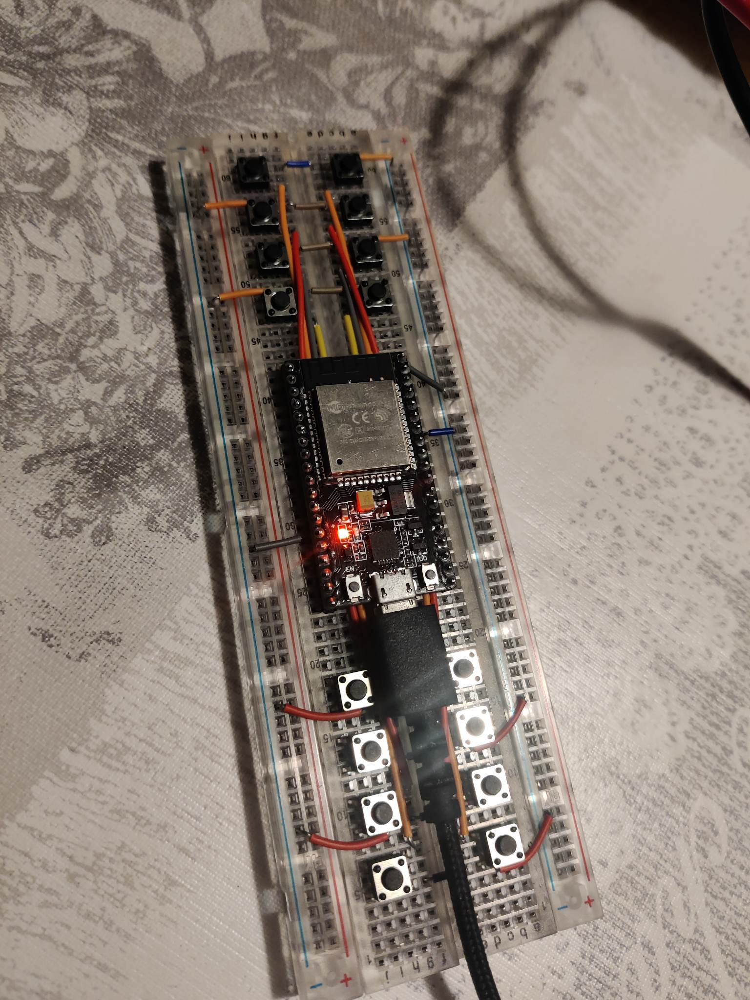

# Remote Controls

The `Remote controls` are the 2 physical Lannootree controllers (ESP32's). These microcontrollers read the state of their buttons and send a command over MQTT when they're pressed. Those commands will be mapped to [controller](../Lannootree_server/controller/README.md) commands by the [button-mapper](../Lannootree_server/button-mapper/README.md).

The `ESP32 mini` had 2 big blue buttons connected (next, previous)

The `ESP32` (picture below) had 16 buttons connected (gif 0-12, pause, play and stop)

.
