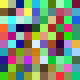
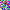

# Effect generator

This part of the Lannootree is the `effect generator`. The effect generator enables someone to program effects for the Lannootree and convert them to `.gif` format.

## Starting the effect generator

After running following command, the generated gifs will appear inside the effect-generator folder:

```bash
npm run dev
```

## Already implemented effects

Inside the `src/effect_generator.js` file, you find this line of code:

```js
manager.generate_gifs([10, 10], 10);  // generates 100x100px gifs (scaled from 10x10)
manager.generate_gifs([10, 10], 1);   // generates 10x10px gifs
```

With the array, you can tell the effect_generator to make effects based on a 10x10 array (rows,cols). The `scale_factor` (most right number) allows you to upscale the gifs. Below, there is an example of the already programmed effects:

| effect name | gif (100x100px)| gif (10x10px)|
|---|---|---|
| Random each (100x100) |  |  |
| Random full (100x100) |  |  |
| Strobe (100x100) |  |  |

Feel free to program more yourself `:)`
